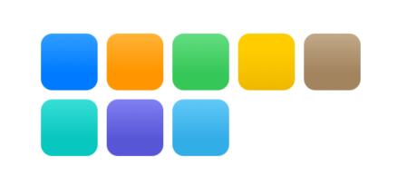
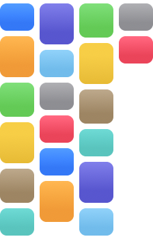
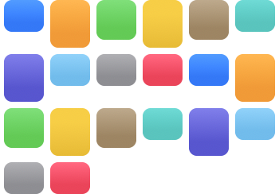
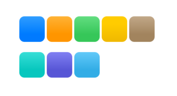
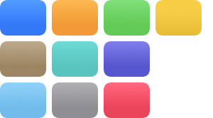
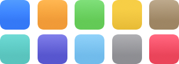
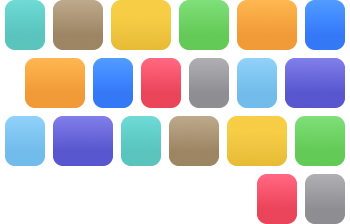

# SwiftUI Flow Layout

Introduces `HFlow` and `VFlow` similar to `HStack` and `VStack`. 
Arranges views in lines and cuts new lines accordingly (if elements don't fit the bounding space).

## HFlow

```swift
import Flow

struct Colors: View {
    let colors: [Color] = [
        .blue,
        .orange,
        .green,
        .yellow,
        .brown,
        .mint,
        .indigo,
        .cyan,
        .gray,
        .pink
    ]

    var body: some View {
        HFlow {
            ForEach(colors, id: \.description) { color in
                RoundedRectangle(cornerRadius: 10)
                    .fill(color.gradient)
                    .frame(width: .random(in: 40...60), height: 50)
            }
        }
        .frame(maxWidth: 300)
    }
}
```



## VFlow

```swift
VFlow {
    ForEach(colors, id: \.description) { color in
        RoundedRectangle(cornerRadius: 10)
            .fill(color.gradient)
            .frame(width: 50, height: .random(in: 40...60))
    }
}
.frame(maxHeight: 300)
```



## Alignment

Supports the same alignments as HStack and VStack do.

```swift
HFlow(alignment: .top) {
    ForEach(colors, id: \.description) { color in
        RoundedRectangle(cornerRadius: 10)
            .fill(color.gradient)
            .frame(width: 50, height: .random(in: 40...60))
    }
}
.frame(maxWidth: 300)
```



Additionally, alignment can be specified on both axes. Ideal for tags.

```swift
HFlow(horizontalAlignment: .center, verticalAlignment: .top) {
    ForEach(colors, id: \.description) { color in
        RoundedRectangle(cornerRadius: 10)
            .fill(color.gradient)
            .frame(width: .random(in: 30...60), height: 30)
    }
}
.frame(maxWidth: 300)
```


## Spacing

Customize spacing between rows and items separately.

```swift
HFlow(itemSpacing: 4, rowSpacing: 20) {
    ForEach(colors, id: \.description) { color in
        RoundedRectangle(cornerRadius: 10)
            .fill(color.gradient)
            .frame(width: 50, height: 50)
    }
}
.frame(maxWidth: 300)
```



## Distribute items

Distribute items evenly by minimizing the empty spaces left in each row. 
Implements the Knuth-Plass line breaking algorithm.

```swift
HFlow(distributeItemsEvenly: true) {
    ForEach(colors, id: \.description) { color in
        RoundedRectangle(cornerRadius: 10)
            .fill(color.gradient)
            .frame(width: 65, height: 50)
    }
}
.frame(width: 300, alignment: .leading)
```



## Justified

```swift
HFlow(justified: true) {
    ForEach(colors, id: \.description) { color in
        RoundedRectangle(cornerRadius: 10)
            .fill(color.gradient)
            .frame(width: 50, height: 50)
    }
}
.frame(width: 300)
```



## Flexibility

```swift
HFlow { // distributes flexible items proportionally
    RoundedRectangle(cornerRadius: 10)
        .fill(.red)
        .frame(minWidth: 50, maxWidth: .infinity)
        .frame(height: 50)
        .flexibility(.minimum) // takes as little space as possible, rigid
    RoundedRectangle(cornerRadius: 10)
        .fill(.green)
        .frame(minWidth: 50, maxWidth: .infinity)
        .frame(height: 50)
        .flexibility(.natural) // expands
    RoundedRectangle(cornerRadius: 10)
        .fill(.blue)
        .frame(minWidth: 50, maxWidth: .infinity)
        .frame(height: 50)
        .flexibility(.natural) // expands
    RoundedRectangle(cornerRadius: 10)
        .fill(.yellow)
        .frame(minWidth: 50, maxWidth: .infinity)
        .frame(height: 50) // takes as much space as possible
        .flexibility(.maximum)
}
.frame(width: 300)
```


## Line breaks

```swift
HFlow {
    RoundedRectangle(cornerRadius: 10)
        .fill(.red)
        .frame(width: 50, height: 50)
    RoundedRectangle(cornerRadius: 10)
        .fill(.green)
        .frame(width: 50, height: 50)
    RoundedRectangle(cornerRadius: 10)
        .fill(.blue)
        .frame(width: 50, height: 50)
    LineBreak()
    RoundedRectangle(cornerRadius: 10)
        .fill(.yellow)
        .frame(width: 50, height: 50)
}
.frame(width: 300)
```


```swift
HFlow {
    RoundedRectangle(cornerRadius: 10)
        .fill(.red)
        .frame(width: 50, height: 50)
    RoundedRectangle(cornerRadius: 10)
        .fill(.green)
        .frame(width: 50, height: 50)
        .startInNewLine()
    RoundedRectangle(cornerRadius: 10)
        .fill(.blue)
        .frame(width: 50, height: 50)
    RoundedRectangle(cornerRadius: 10)
        .fill(.yellow)
        .frame(width: 50, height: 50)
}
.frame(width: 300)
```


## RTL

Adapts to left-to-right and right-to-left environments too.

```swift
HFlow {
    ForEach(colors, id: \.description) { color in
        RoundedRectangle(cornerRadius: 10)
            .fill(color.gradient)
            .frame(width: .random(in: 40...60), height: 50)
    }
}
.frame(maxWidth: 300)
.environment(\.layoutDirection, .rightToLeft)
```


